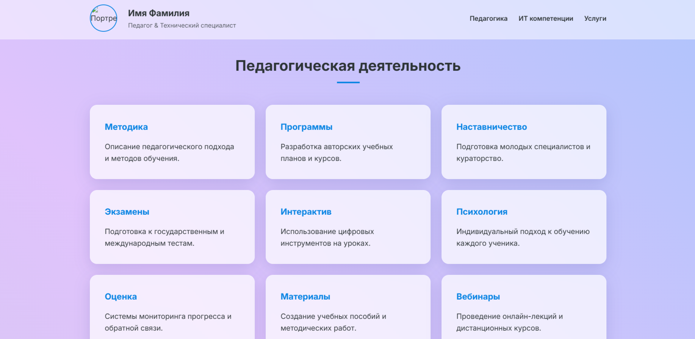
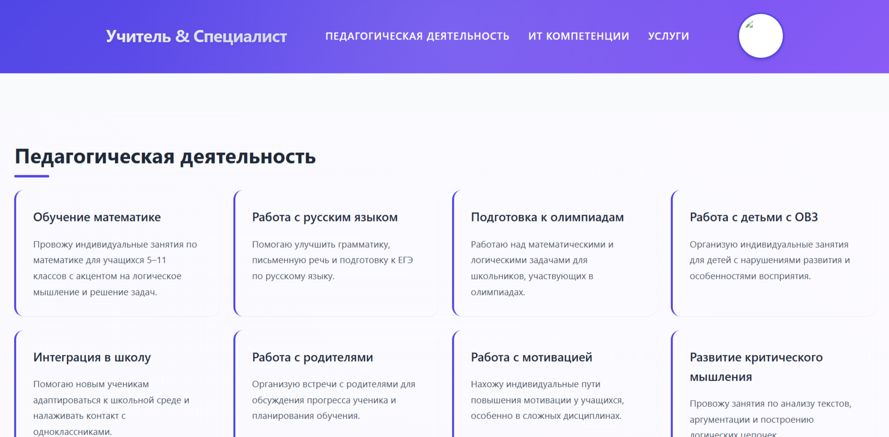
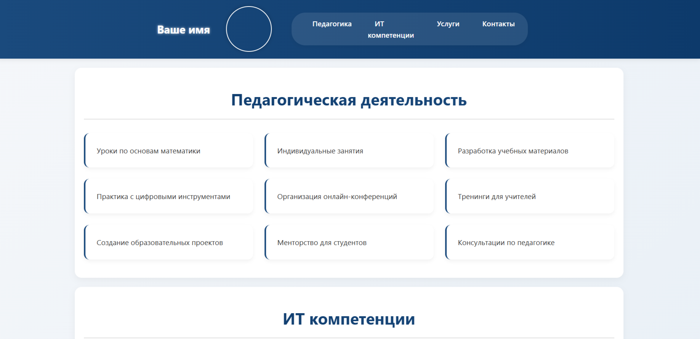
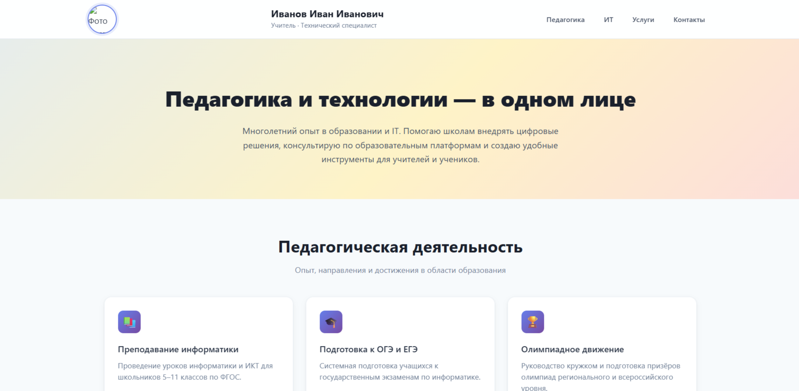
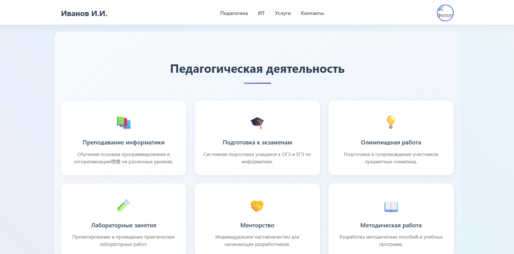
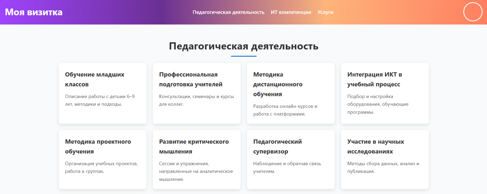

## Тестирование локальных моделей  
для генерации шаблона конверсионного сайта-портфолио

<table>
  <tr>
    <td>Gemma-4-26B-A4B-it-UD-IQ4_XS 

      </td>
    <td>Gemma-4-E4B-Agenti  

      </td>
  </tr>
  <tr>
    <td>Gemma-4-E4B-Uncensored  

      </td>
    <td>Jan-code-4b-Q8_0  

      </td>
  </tr>
  </tr>
  <tr>
    <td>Jan-v2-VL-high-Q6_K

      </td>
    <td>Qwen3.5-9B-Q4 

      </td>
  </tr>
  <tr>
    <td>Qwen3.6-27B-IQ4_XS

      </td>
    <td>Qwen3.6-27B-Q3_K_M 

      </td>
  </tr>
  <tr>
    <td>Qwopus-GLM-18B-Merged

      </td>
    <td>VibeCoder-20B-RL1_0-MXFP4_MoE 

      </td>
  </tr>
</table>

